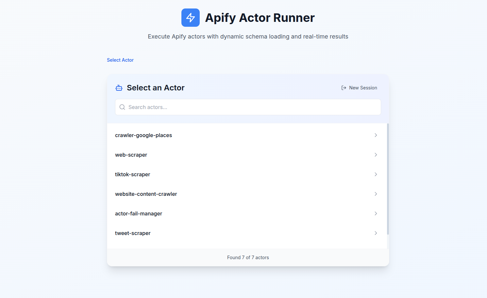
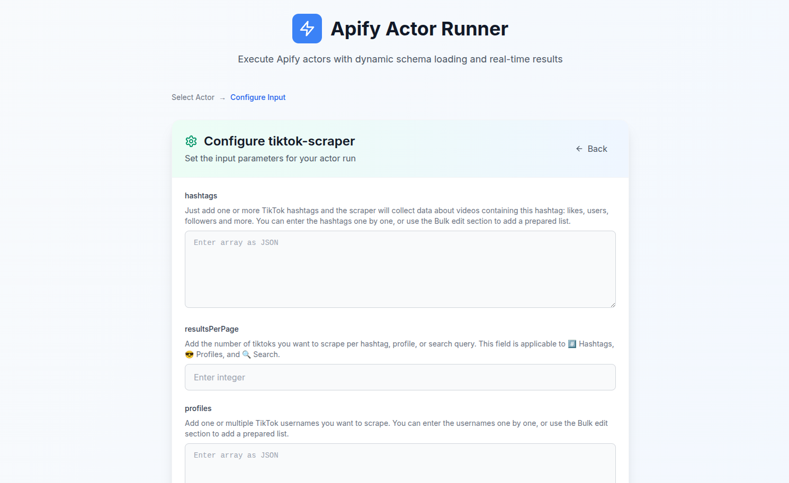
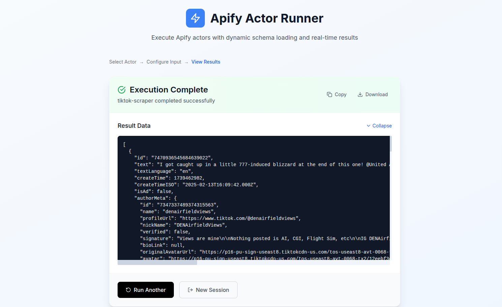

# Apify Actor Runner UI

## Installation & Running

### Prerequisites
- Node.js (v18+ recommended)
- npm (v9+ recommended)

### 1. Clone the repository
```bash
git clone https://github.com/shresthasriv/apify-ui-integration.git
```

### 2. Install dependencies
#### Backend
```bash
cd server
npm install
```
#### Frontend
```bash
cd ../client
npm install
```

### 3. Start the app
#### Backend
```bash
cd server
npm start
```
#### Frontend (in a new terminal)
```bash
cd client
npm run dev
```

- The frontend will be available at `http://localhost:5173` (or as shown in your terminal)
- The backend runs on `http://localhost:3001` by default

## Actor Used for Testing
- **Google Maps Scraper** (`compass/crawler-google-places`)
- **TikTok Scraper**
- **Apollo Scraper**

## Assumptions Made
- The Apify API may not always return a valid input schema; the backend will attempt to scrape the schema from the Apify Store page as a fallback.
- The frontend dynamically renders forms based on the extracted schema, supporting both JSON Schema and best-effort reconstructions from HTML.
- The user must provide a valid Apify API key to access their actors.

## Screenshots

### 1. Actor Selection


### 2. Dynamic Input Form


### 3. Actor Run Result



---

